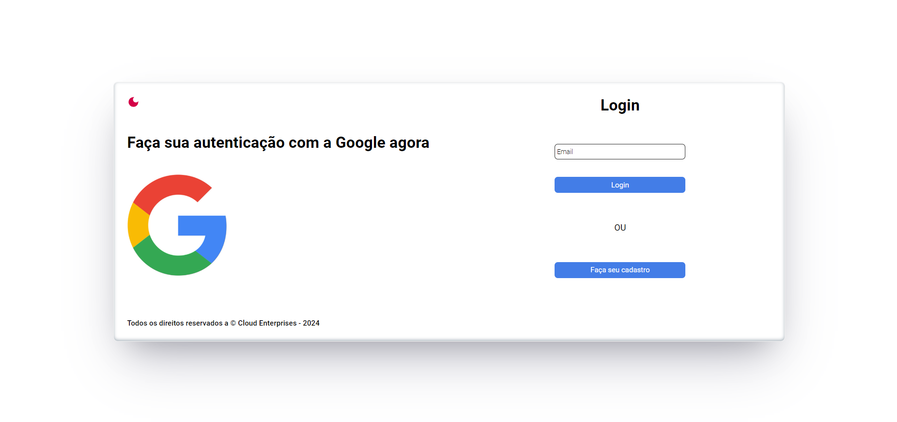

# Projeto Full Stack Charged Cloud

## Descrição
- Este projeto tem o objetivo de demonstrar minhas habilidades e conheicmentos em Desenvolvimento Web Full-Stack.
- A aplicação tem sua base em utilizar Nest.js (Backend), Vite (Frontend) e Mysql (Banco de dados).

## Checklist de Tarefas

1. Backend
- [x] Autenticação de Usuário (Via Google).
- [ ] CRUD de Empresas.
- [ ] Desenvolver uma API RESTful utilizando Nest.js
- [ ] Implementar endpoints para as operações de criação, leitura, atualização e exclusão de empresas.
- [x] Conectar a API a um banco de dados MySQL para persistência dos dados.

2. Frontend
- [x] Utilizar Vite como ferramenta de build para o projeto frontend.
- [x] Login com autenticação via Google
- [ ] Visualização da lista de empresas.
- [ ] Formulários para criação e edição de empresas.
- [ ] Funcionalidade para exclusão de empresas.
- [x] Garantir uma interface responsiva e amigável ao usuário.

3. Banco de Dados
- [ ] Modelar a tabela de empresas com campos relevantes (exemplo: ID, nome, endereço, telefone, etc.).
- [ ] Utilizar práticas adequadas de modelagem e normalização.

## Imagens Aplicação

## Como utilizar o serviço do Google

## Como usar

## Tecnologias Utilizadas e Justificativas

## Autor
- Augusto Mariano